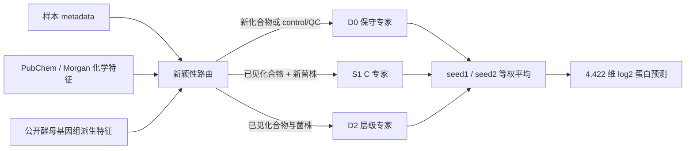

# GOAI 酵母虚拟细胞 V2：模型、训练与结果总结

> 文档状态：基于 2026-08-15 冻结的 S2C 双随机种子最终候选整理。文中所有数值来自已经落盘的报告、CSV、JSON 与 checkpoint；规划代理不写成官方分数，未读取的测试真值不虚构为测试成绩。

## 1. 我们最终做出了什么

我们构建了一个面向酵母扰动蛋白质组预测的**对照锚定、分支解耦、按新颖性路由的双随机种子集成模型**。模型输入菌株、化合物、培养条件和技术批次信息，输出固定顺序的 4,422 维 log2 蛋白强度向量。

最终方案不是让单一模型处理所有样本，而是根据样本相对训练集的“新颖程度”选择三个专家之一：

- **D0 保守专家**：用于训练中未见过的化合物，以及 Water、DMSO、Quality Control。它不使用化学数值特征，避免不可靠的结构迁移把新药方向预测反。
- **S1 C 专家**：用于已见化合物、未见菌株且技术批次 tuple 已知的样本。使用 Morgan 化学特征、菌株特征、flat batch 和实验性 FC 监督。
- **D2 专家**：用于化合物和菌株均在训练中见过的样本。使用 Morgan 化学特征、菌株特征、层级 batch 和实验性 FC 监督。
- 三个专家各训练 seed `20260814` 与 `20260815`，同一专家的两个 seed 预测按 0.5/0.5 平均。

最终测试 metadata 的路由结果为：D0 2,997 个样本，S1 C 1,322 个样本，D2 135 个样本。路由规则只依赖训练 metadata 中是否见过实体和技术 tuple，没有按具体药名手工修补。

## 2. 模型架构

单个专家把最终预测分解为：

\[
\hat y = \hat y_{baseline} + \Delta_{response} + \Delta_{batch}
\]

其中：

- `y_baseline` 表示酵母在菌株、培养基、温度和时间条件下的基础蛋白状态；该分支不输入化合物和批次字段。
- `delta_response` 表示扰动响应；由化学特征、菌株特征和二者交互产生。
- `delta_batch` 表示技术批次偏移；只输入 `data_source`、`instrument` 和 `Yeast_cell_plate`。
- 输出通过 rank=16 的低秩蛋白基底，从 latent_dim=32 的条件表示解码到 4,422 个蛋白。
- 模型 dropout 为 0.05，响应 RMS 上限为 0.75，并使用响应门控限制异常放大。

### 2.1 基础状态与批次分支

基础状态先用 751 个训练集 Water/DMSO control 学习。批次分支由 `source → instrument → plate` 三层残差构成：如果遇到未见 plate，只将 plate 残差回退为零；遇到未见 instrument 时同时关闭 instrument 和 plate；全部技术层级未知时 `delta_batch=0`。

层级设计的目的不是删除批次信息，而是让批次校准具有明确的层次与 OOV 回退。公开 validation/test 中的 source、instrument 和完整 batch tuple 实际都在 train 出现过，因此最终保留已知批次上的校准能力。

### 2.2 化合物响应分支

我们最初准备了 2,048 bit Morgan fingerprint 和 217 个 RDKit descriptors，共 2,265 维化学特征。但消融显示完整化学特征在部分新药上发生明显负迁移，因此最终模型只在 S1 C、D2 使用 Morgan；D0 对新化合物关闭化学数值输入。

这是一种比赛导向的保守选择：我们没有证明“看到结构就能准确预测新药蛋白响应”，所以没有让不稳定的化学分支控制所有测试样本。

## 3. 实际使用的数据

### 3.1 比赛数据

- train：5,920 个样本，蛋白由 5,243 个原始列按 train-only 规则冻结为 4,422 个。
- Stage A：751 个 Water/DMSO 训练 control。
- Stage B：5,078 个 treatment，其中 4,121 个用于梯度训练，957 个按技术 tuple 分组留出。
- public validation：`val_chem_only` 1,065、`val_strain_only` 1,547、`val_both` 269、`val_time` 157。
- 最终评分共同子集：981、1,313、266、134 个样本；共同子集只保留能够进行对应 control/残差诊断的样本。
- test metadata：4,454 个样本。未读取 test proteome 真值。

### 3.2 外部数据

最终候选实际使用两类公开外部信息：

1. **PubChem + RDKit 化学信息**
   - 57 个比赛化合物/特殊实体；最终状态为 confirmed 52、proxy 1、special control 3、unresolved 1。
   - 生成 Morgan fingerprint、RDKit descriptors、映射置信度和结构有效性标记。
   - Oligomycin 使用 Oligomycin A 代理；Tunicamycin 保持 unresolved；Cisplatin 和 NaCl 身份确认但数值结构特征采用显式 fallback。

2. **Peter et al. 2018 / 1011 Yeast Genomes + S288C 参考信息**
   - 为 BAH、BAI、CEK、CGD、CRD、DHY210 生成 24 维可解释菌株特征。
   - scaler/PCA 只使用训练菌株 BAH、CEK、CGD 拟合。
   - BAI、CRD 只执行冻结转换；DHY210 使用 S288C 代理且明确标注为 proxy，而非精确等价。

NetwoRx、Parsons、Hillenmeyer、MOSAIC、HIP/HOP 只做过覆盖或失败路线诊断，**没有进入最终模型**。GO/KEGG/PPI 和旧单参数 GNN 也没有进入最终候选。

## 4. 训练方式

### 4.1 两阶段训练

**Stage A：学习基础状态和批次校准**

- 只使用 751 个训练 control。
- 层级专家使用全部训练 control 固定训练 30 epochs，不用 validation 选择 epoch。
- flat 专家使用 205 个 validation control 做 control-only 早停诊断。

**Stage B：学习 treatment response**

- baseline、genome 和已训练 batch 组件按专家配置冻结或低学习率更新。
- 主要训练 chemical encoder 与 response branch。
- batch size=64，weight decay=0.0001，最多 100 epochs，patience=12。
- 早停 monitor 是四个验证场景等权的 mask-aware Huber，不由单一场景主导。
- 最终两个随机种子完全独立训练，再在预测层等权平均。

### 4.2 损失函数

基础损失为 mask-aware Huber，所有缺失蛋白位置均不参与损失。D2 与 S1 C 额外加入：

- FC Huber，权重 0.05；
- 行级 mask-aware Pearson FC loss，权重 0.05；
- response magnitude 正则，权重 0.01。

这里必须强调：FC 配对使用 `pert_id_parity_v1` 推断的 Water/DMSO 规则，训练期匹配 3,912/4,121 个 treatment，覆盖率 94.93%。它是**非官方实验映射**，没有用于早停，不能把对应结果写成官方 FC 分数。

### 4.3 最终六个模型的训练状态

| 专家 | seed1 最佳 epoch / monitor | seed2 最佳 epoch / monitor | 主要输入与损失 |
|---|---:|---:|---|
| D0 | 20 / 0.194742 | 10 / 0.194023 | 无化学数值特征；Huber |
| D2 | 12 / 0.194093 | 16 / 0.191294 | Morgan + genome + hierarchical batch + 实验 FC |
| S1 C | 7 / 0.198458 | 47 / 0.202288 | Morgan + genome + flat batch + 实验 FC |

monitor 为四场景等权 macro Huber，数值越低越好；它不是训练集内拟合分，也不是官方总分。

## 5. 训练数据侧结果

我们没有把训练集内 loss 当作主要成绩，因为高维模型很容易在已见样本上得到过于乐观的结果。更可信的训练侧证据是 957 个 treatment 的技术 tuple 分组留出，其中标签不参与梯度和早停。

| 训练侧模型（seed1） | 留出样本 | 绝对 RMSE ↓ | MAE ↓ | raw-FC PCC ↑ | FC RMSE ↓ |
|---|---:|---:|---:|---:|---:|
| D0：无化学特征 | 957 | 0.5785 | 0.4025 | 0.3246 | 0.5567 |
| D1：Morgan + Huber | 957 | 0.5295 | 0.3636 | 0.3857 | 0.5077 |
| D2：Morgan + 实验 FC | 957 | **0.5274** | **0.3619** | **0.4019** | **0.5033** |

这说明 Morgan 和实验 FC 在训练分布内部的组留出上有价值。但它们在真正的新化合物验证中并不稳定，因此不能仅凭这张表得出“已经解决新药泛化”的结论。

批次模块本身也做了独立诊断：

| 批次验证 | hierarchical | flat | no-batch |
|---|---:|---:|---:|
| Plate 五折平均 RMSE | **0.6609** | 0.7276 | 0.9198 |
| Instrument 五折平均 RMSE | **0.8011** | 0.8709 | — |
| 205 个 validation control RMSE | **0.7666** | 0.7948 | 1.0295 |

层级 batch 对 flat/no-batch 的改善在每个预声明折上均成立，说明批次分支不是纯粹记住某一张 plate；但公开数据没有真正未见的技术 tuple，独立内部评测仍可能发生分布变化。

## 6. 公开验证集结果

### 6.1 绝对蛋白预测

以下为最终 S2C 双 seed 均值在评分共同子集上的结果：

| 场景 | 样本数 | log2 RMSE ↓ | MAE ↓ | Global R² ↑ | 样本 PCC 中位数 ↑ | 蛋白 R² 中位数 ↑ |
|---|---:|---:|---:|---:|---:|---:|
| val_chem_only | 981 | 0.5492 | 0.3861 | 0.9594 | 0.9829 | 0.6671 |
| val_strain_only | 1,313 | 0.7181 | 0.4937 | 0.9291 | 0.9657 | 0.4077 |
| val_both | 266 | 0.7894 | 0.5483 | 0.9160 | 0.9623 | 0.4603 |
| val_time | 134 | **0.4993** | **0.3456** | **0.9662** | **0.9859** | **0.6355** |
| 四场景等权平均 | — | **0.6390** | 0.4434 | 0.9426 | 0.9742 | 0.5427 |

`val_both` 仍然最难：新化合物与新菌株同时出现时，绝对误差最大，说明两个 OOD 因素叠加后模型的保守锚定仍不够。

### 6.2 与比赛评分相关的六类诊断

| 诊断模块 | val_chem_only | val_strain_only | val_both | val_time | 解释 |
|---|---:|---:|---:|---:|---|
| 样本 PCC 中位数 | 0.9829 | 0.9657 | 0.9623 | 0.9859 | 整体蛋白谱形状是否接近真值 |
| global raw-FC PCC | 0.3268 | 0.2664 | 0.2165 | 0.4082 | 是否预测到相对 control 的变化 |
| context residual PCC | **0.2152** | — | — | — | 新化合物相对同上下文平均的特殊响应 |
| drug residual PCC | — | **0.2857** | — | — | 新菌株相对药物平均响应的偏移 |
| 高效应蛋白方向准确率 | 0.8112 | 0.7979 | 0.7681 | 0.8358 | 真值 \(|\Delta|>1\) 时方向是否正确 |
| 蛋白 R² 中位数 | 0.6671 | 0.4077 | 0.4603 | 0.6355 | 单个蛋白跨样本的可预测性，诊断项 |

四场景平均 raw-FC PCC 为 **0.3045**，高效应方向准确率平均为 **0.8033**。这里的 residual 与 FC 数值均是本地 planning proxy，`official_score=false`。

### 6.3 与早期 V2 和 Matched Control 对照

在相同评分共同子集上，最终双 seed 路由集成相对早期单一 batch-enabled V2 的绝对 RMSE 均改善：

| 场景 | 早期 V2 RMSE | 最终 V2 RMSE | 相对改善 |
|---|---:|---:|---:|
| val_chem_only | 0.6196 | **0.5492** | 11.36% |
| val_strain_only | 0.7368 | **0.7181** | 2.54% |
| val_both | 0.8315 | **0.7894** | 5.06% |
| val_time | 0.5563 | **0.4993** | 10.25% |
| 四场景平均 | 0.6860 | **0.6390** | 6.86% |

四场景平均 raw-FC PCC 从 0.2728 提高到 0.3045；context residual PCC 从 0.1978 提高到 0.2152；drug residual PCC 从 0.2839 小幅提高到 0.2857。

但 Matched Control 的四场景平均绝对 RMSE 为 **0.4027**，仍明显优于最终 V2 的 0.6390。Matched Control 的问题是它本质上预测 \(\Delta=0\)：绝对状态很准，却没有真正生成药物响应。最终 V2 在 context residual（0.2152 vs 0.1880）、drug residual（0.2857 vs 0.1372）和高效应方向上明显提供了额外响应信号，但尚未同时保住 Matched Control 的绝对精度。

### 6.4 与可复现 V1 的趋势对照

可复现的 V1 是 ConditionMLP：化合物与菌株主要依赖类别编码，只有 mask-aware MSE，没有可靠的外部实体迁移和明确的 baseline/response/batch 分解。

| 场景 | V1 RMSE | 最终 V2 RMSE | V1 蛋白 R²中位数 | 最终 V2 蛋白 R²中位数 |
|---|---:|---:|---:|---:|
| val_chem_only | 0.6898 | 0.5492 | 0.4628 | 0.6671 |
| val_strain_only | 0.8711 | 0.7181 | 0.1829 | 0.4077 |
| val_both | 0.9551 | 0.7894 | 0.2033 | 0.4603 |
| val_time | 0.5185 | 0.4993 | 0.5679 | 0.6355 |

这张表只能作为趋势参考：V1 使用完整 validation 样本，最终 V2 表使用评分共同子集，并非严格同一评价子集。V1 没有可恢复 checkpoint，也无法补做同口径 FC/residual 模块，因此不能据此宣称正式提升比例；能确认的是 V2 解决了 V1 的输入语义、未知类别、数据合同和防泄漏缺陷，并在当前可复现绝对指标上呈现改善趋势。

## 7. 测试数据集状态

最终模型已经对 4,454 个 test metadata 样本完成两次独立推理：

- 输出形状：4,454 × 4,423，其中第一列为 `sample_ID`，其余为 4,422 个蛋白。
- 两次 float32 推理最大差异：0.0。
- `prediction.csv` SHA-256：`9739f087788bfd37f57750564c9d351bbf37bd867ab7e87820294eec52c8dbe9`。
- 无 NA、无 inf，保持 log2 尺度，没有裁剪、缩放或后处理校准。
- test proteome 真值未打开，`test_proteome_opened=false`。

因此目前**没有合规的测试集 RMSE、PCC 或官方总分**。我们拥有的是可提交的测试预测，不是测试真值成绩。若将来由主办方返回榜单分数，应将其作为独立的官方测试结果补入，不能拿 validation planning proxy 代替。

## 8. 关键消融告诉了我们什么

### 8.1 批次校准有效，但依赖仍偏强

最初 no-batch V2 在 `val_chem_only`、`val_both` 和 `val_time` 明显退化，说明技术批次确实解释了大量蛋白强度差异。层级 batch 比 flat batch 更稳健，并通过 OOV 语义测试；但 batch 分量仍可能吸收部分生物效应，独立内部新批次是主要风险之一。

### 8.2 化学特征不是“没被使用”，而是会产生错误方向

correct/shuffle/zero 消融显示：模型会积极使用化学特征，但 correct 在部分新药上反而劣于 zero。响应方向分析进一步发现 Hydroxyurea、FCCP、Amphotericin B 等药物的预测响应曾与 target residual 呈负方向。

Morgan-only 能修复 Hydroxyurea 和 FCCP，却不能修复 Amphotericin B。两 seed 的训练药物留一 CV 中，Morgan gain 的均值为 -0.0275、中位数为 +0.0107，说明多数药物可能小幅获益，但少数药物会发生严重负迁移。因此最终对新药采用 D0，而不是盲目信任结构编码。

### 8.3 FC loss 有方向价值，但不是根本解法

实验 FC 使 D2 在 957 个训练组留出上的 raw-FC PCC 提高到 0.4019，并在部分 validation 场景改善 FC PCC；但对新药方向没有普遍修复。原因不是简单“FC 权重不够”，而是结构到蛋白响应的映射本身仍缺少足够的可迁移监督。

### 8.4 外部酵母功能预训练没有进入最终模型

NetwoRx 的结构→酵母功能 Ridge OOD 验证发生严重负迁移，低相似药物和描述符极端外推尤其不稳定。该路线没有通过预声明门槛，因此没有接入 V2。我们保留了失败结论，而没有因为“用了更多外部数据”就宣称模型更先进。

## 9. 当前方案的优势

1. **工程与评测边界严格。** 4,422 个蛋白顺序、train-only 统计、mask-aware 损失、control 匹配和 test 文件访问均有自动测试与哈希合同。
2. **模型语义比 V1 清楚。** baseline、response、batch 三个分量的输入边界明确，control/QC 的 response 在最终推理层严格清零。
3. **批次处理更稳健。** source/instrument/plate 分层建模，未见层级逐级回退，不再让单一 plate embedding 无限制主导预测。
4. **面对新药更加诚实。** 化学特征有效性不足时采用保守专家，而不是把已见药物记忆误写成零样本能力。
5. **双 seed 与固定路由提升稳定性。** 最终双 seed 平均在三套 planning proxy 中均排名第一，四场景平均 RMSE 和 raw-FC PCC 都优于任一单 seed。
6. **结果可复现。** 六个 checkpoint、配置、训练历史、外部特征、路由、文件哈希和完整推理脚本均已冻结；独立便携推理复现了同一 prediction hash。

## 10. 仍然存在的问题

1. **绝对预测尚未超过 Matched Control。** 当前学习模型增加了响应信号，却牺牲了相当一部分静态状态保真度。
2. **真正的新药泛化没有解决。** `context_residual_pcc=0.2152` 仍偏低，D0 对新药本质上是风险控制，而不是机制级预测。
3. **新药+新菌株最困难。** `val_both` RMSE 0.7894、raw-FC PCC 0.2165，说明双重 OOD 仍是明显瓶颈。
4. **化学表征的跨药迁移不稳定。** Morgan 对不同药物的作用方向不一致，RDKit descriptors 与简单融合曾带来更严重的负迁移。
5. **实验 FC 口径不是官方规则。** Water/DMSO 映射尚未获得主办方权威确认，对应损失与指标只能写成实验诊断。
6. **批次泛化证据有限。** 公开 validation/test 没有真正未见的技术 batch tuple，内部评测若换成新 source/instrument，性能可能下降。
7. **外部菌株特征较简单。** 只有 6 个比赛菌株和 3 个训练菌株用于拟合转换，DHY210 还是 S288C 代理，无法支撑强基因组机制结论。
8. **高效应蛋白检测的精度仍低。** 虽然方向准确率约 0.80，但四场景 precision 仅约 0.064–0.232，模型存在高效应预测偏多的问题。

## 11. 对当前模型水平的判断

V2 已经从“普通条件 MLP”推进为一个**可复现、评测对齐、能输出非零生物响应、并对失败模块有保守回退的竞赛系统**。它在最终共同子集上达到平均 RMSE 0.6390、平均 raw-FC PCC 0.3045，并明显改善了早期 V2 的四场景表现。

但它还不是一个能够根据任意新药结构准确生成蛋白响应的通用虚拟细胞。当前最可靠的部分是基础状态与已知技术条件校准；最薄弱的部分是新化合物特异响应，尤其是新化合物与新菌株同时出现时。因此，正确的成果表述是：

> 我们建立了一个稳健、可审计的条件响应预测框架，并通过层级批次、对照锚定、新颖性路由和双 seed 集成提高了公开验证性能；模型已经学到一定的 FC、context residual 和 drug residual 信号，但真正的新药零样本泛化仍未被充分解决。

## 12. 复核入口

- 最终提交前审计：`reports/MODEL_V2_STAGE_S3_FINAL_PRESUBMISSION_AUDIT.md`
- 第二 seed 与双 seed 指标：`reports/MODEL_V2_STAGE_S2D_SECOND_SEED_REPORT.md`
- 路由集成：`reports/MODEL_V2_STAGE_S2C_NOVELTY_GATED_ENSEMBLE_REPORT.md`
- 层级 batch：`reports/MODEL_V2_STAGE_S2A_HIERARCHICAL_BATCH_REPORT.md`
- 评分对齐：`reports/COMPETITION_SCORE_ALIGNMENT_AUDIT.md`
- 模型卡：`docs/MODEL_CARD.md`
- 包内文件哈希：`PACKAGE_MANIFEST.json`
