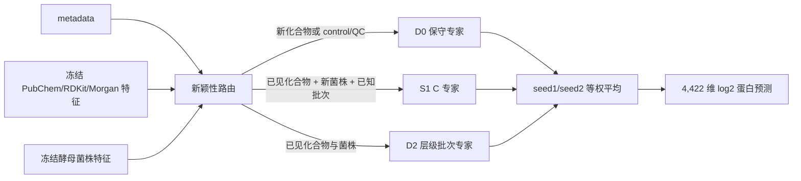

# V2 架构与推理逻辑



单个 V2 专家的预测分解为：

```text
y_pred = y_baseline + delta_response + delta_batch
```

- `y_baseline`：菌株、培养基、温度和时间定义的基础状态，不输入化合物和批次字段。
- `delta_response`：化学特征、菌株及其交互产生的响应；control/QC 在最终路由层严格清零。
- `delta_batch`：data_source → instrument → plate 的层级技术校准；未见层级逐级回退为零。
- 蛋白输出由训练得到的低秩基底解码到冻结的 4,422 个蛋白顺序。

路由是基于训练 metadata 中是否见过实体和技术 tuple 的通用规则，不包含针对某个药名的手工修补。
