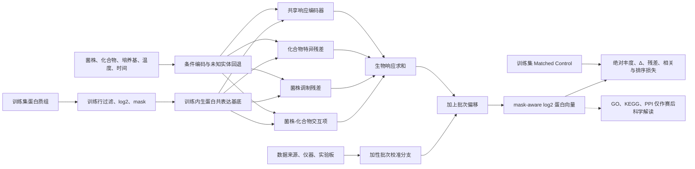
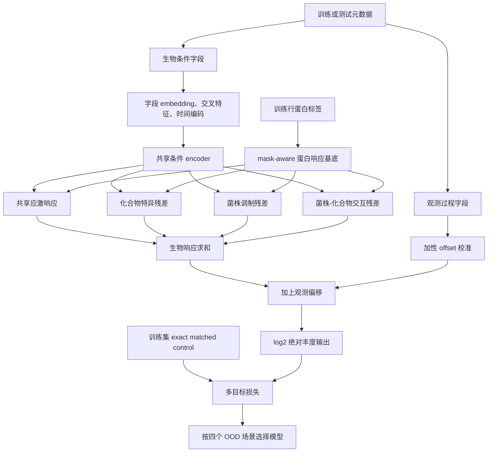
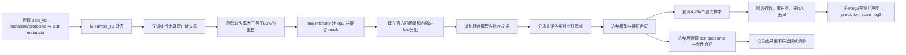

# 一、项目概述

## 1.1 项目名称

面向跨条件响应预测的稳健酵母虚拟细胞

## 1.2 参赛方向

我们参加赛道三·虚拟细胞方向，即基于酵母扰动蛋白质组数据的条件响应预测，并选择封闭数据榜。封闭数据榜只允许使用组委会发布的训练数据、字段字典与官方基线，能够公平检验模型从内部数据学习规律的能力；开放知识榜允许公开数据库、文献知识、通路模型与工具调用并要求完整披露。距离初赛提交约一周，我们选择封闭数据榜，是为了把有限研发时间集中在数据口径、正交验证和稳健建模上，避免外部实体匹配错误成为主要不确定性。

## 1.3 方案概述

我们研究 AI 能否在未见菌株、未见化合物及时间外推条件下，直接预测酿酒酵母的 log2 蛋白质组响应。方案以封闭榜条件编码和未知实体回退为入口，以共享响应、化合物残差、菌株调制与交互项构成残差解码器，将仪器、数据源和实验板交给独立批次校准分支，再以训练集内生的蛋白共表达基底和 mask-aware 多目标损失约束输出。我们按正交场景推进研发，已在真实 WAYB/WAYC 数据上跑通轻量 PyTorch 双分支 Demo、验证选择与冻结后测试自评；完整残差架构和多目标损失仍按一周路线逐项消融。

总体架构强调生物条件、观测过程和蛋白结构三条信息流相互分离，最终只提交 log2 绝对丰度：

# 二、科学问题理解

## 2.1 科学问题与研究对象

我们的研究对象是酿酒酵母。它是真核细胞，细胞结构和调控逻辑比原核生物更接近复杂真核系统；它生长快、培养成本低，能够在多个菌株、培养基、温度和时间条件下系统开展实验；蛋白质组测量直接面向正在发挥功能的分子层，而不只停留在 mRNA 层；同时，酵母实验不存在人源细胞研究中的伦理审查负担。因此，它既保留了真核细胞响应的复杂性，又把实验条件控制在可重复、可扩展的范围内。

我们的核心科学问题是：AI 能否跨细胞背景预测化学扰动后的蛋白质组响应。每个样本由菌株、化合物、培养基、温度、处理时间以及观测过程元数据描述，模型输出完整的 log2 蛋白强度向量。任务不是把一个 control 蛋白向量变换为处理向量，也不在推理时输入 control；它要求模型直接从条件生成响应。因此，我们把任务定义为 OOD 条件生成/高维回归：模型必须同时学习静态状态，即特定背景下的蛋白丰度基线；学习动态响应，即化合物引起的 Δ；并利用训练数据中可获得的先验结构，即蛋白共变和条件相似性。

关键数字集中给出了任务的难度边界：

| 难度维度 | 官方口径 | 对建模的直接含义 |
|---|---:|---|
| 条件组合 | 6 菌株 × 56 化合物（含对照，其中 55 个为化学扰动）× 2 培养基 × 2 温度 × 6 时间点 | 条件空间远大于实际观测组合，不能依靠组合记忆 |
| 实体划分 | 菌株为 4 训练、1 验证、1 测试；化合物为 38 训练、6 验证、11 测试 | 验证和测试包含实体级 OOD |
| 训练样本 | `split_final=train` 共 5,920 个，涉及 4 菌株 × 38 化合物 | 相对于高维输出属于小样本任务 |
| 训练与验证合计 | 8,958 个样本 | 可用于冻结划分下的训练和诊断，但验证行不得反哺训练统计量 |
| 测试样本 | 4,454 个 | 只开放元数据，蛋白真值由主办方持有 |
| 原始输出 | 5,243 个蛋白的 raw intensity | 必须处理系统性缺失和长尾分布 |
| 过滤后输出 | 教程预期 4,232；当前文件实测 4,422 | 严格只用 5,920 个训练行计算缺失率并删除大于等于 80% 的蛋白；实测与教程预期相差 190 个 |
| 高缺失蛋白 | 约 20% 的蛋白在大于等于 80% 的样本中缺失 | NA 不是 0，训练必须保留 mask |
| `val_chem_only` | 1,065 个样本，菌株已见、化合物未见 | 检验新化合物迁移 |
| `val_strain_only` | 1,547 个样本，菌株未见、化合物已见 | 检验新菌株迁移 |
| `val_both` | 269 个样本，菌株与化合物均未见 | 最极端的双重零样本泛化 |
| `val_time` | 157 个样本，按处理时间外推 | 检验动力学外推 |

我们的判断是，真正瓶颈不是把 5 个条件字段送入一个回归器，而是用 5,920 个训练样本支撑当前实测 4,422 维输出的实体级外推。封闭榜又切断了基因组和化学结构提供的实体语义，新菌株和新化合物无法凭 one-hot 身份获得区分性信息。因此，我们把模型目标分成两层：对已见实体学习可解释的特异残差；对未见实体采用经过训练的共享响应、上下文条件和保守回退，避免任意外推。这个边界决定了我们不宣称封闭榜能够真正识别两个未知化合物的结构差异，而是用严格 CV 测量可实现的泛化上限。

## 2.2 科学意义

### 应用价值

我们的模型将菌株、化合物和环境条件映射为蛋白质组状态，可在实际实验前筛选更值得测量的组合。研究人员可以优先验证预测差异大、通路响应明确或跨菌株反应不一致的条件，从而缩小实验范围，加快耐受性、发酵性状和化合物作用机制的假设检验。我们不会把预测当作实验替代物，而把它定位为实验排序器：模型先给出响应和不确定边界，实验再验证关键组合。

### 方法价值与可迁移性

该任务同时包含高维输出、系统性缺失、批次差异和实体级零样本泛化，比随机划分下的常规回归更接近真实科研场景。我们的残差分解把静态状态、共享动态响应和实体特异响应拆开；独立批次分支把仪器偏差从生物机制中隔离；训练内生蛋白基底把蛋白间协同变化纳入解码。该组合不依赖酵母专有的输出维度，后续可以迁移到人类细胞系扰动、药物筛选和其他组学条件响应任务。

### 与已有工作的边界

虚拟细胞的概念演进经历了三个边界。早期全细胞模型依靠科学家手写方程描述细胞子模块，受限于方程不完备和规模；AI 虚拟细胞概念把目标改为从数据中学习细胞规律；第一届虚拟细胞挑战赛进一步验证了对扰动后转录组响应的预测。本赛题把输出从转录组推进到更接近功能层的蛋白质组，并把单一背景推进到多菌株、多培养条件与时间外推的正交泛化。我们的推进点不在于把更大网络套在数据上，而在于首次按评测定义显式分解蛋白质组 Δ、隔离观测过程，并在封闭数据约束下诚实处理未知实体。科学意义评审占 30%，我们将用通路富集、关键蛋白核验、菌株特异响应和时间动力学解释模型是否学到生物规律，而不是只展示一个总分。

# 三、技术方案与预期方法路线

## 3.1 技术方案

### ① 任务形式化

对样本 $i$，生物条件记为 $x_i=(s_i,c_i,m_i,T_i,t_i)$，分别表示菌株、化合物、培养基、温度和时间；观测过程记为 $q_i=(d_i,r_i,p_i)$，分别表示数据来源、仪器和实验板。模型输出 $\hat{y}_i\in\mathbb{R}^{P}$，其中 $P$ 由训练行缺失过滤动态确定，当前真实文件为 4,422，而教程预期为 4,232。非缺失标签为 $M_{ij}=1$，缺失位置为 0。基础损失只在 $M_{ij}=1$ 的位置计算。提交文件包含 4,454 个测试样本的 log2 绝对丰度；评测服务器再以真实 matched control 计算 $\Delta_{pred}=\hat{y}_{treat}-y_{control}$，我们不提交 Δ，也不在推理时读取 control 蛋白向量。

### ② 我们的方案架构

我们将创新点控制在 5 项：指标对齐的层次残差解码、观测过程加性校准、训练内生蛋白共表达基底、mask-aware 多目标损失、封闭榜未知实体回退。严格 CV 是保证这些创新可信的评估纪律，不另包装为第六项创新。五项设计在同一数据流中各自承担不同职责，不存在“残差分解”和“端到端 MLP”互相替代的矛盾：MLP 只是共享编码器和残差头的实现组件，最终输出仍由显式分解的各项求和得到。

我们选择残差分解而不是单体端到端 MLP，因为评分模块 1 的匹配对照原始 FC 占 25%，模块 3 和模块 4 的两个残差各占 20%，共有 65% 的技术分围绕处理-对照差异展开。单体 MLP 会把共享背景和特异响应混合在同一输出头中，而我们的预测写成：

$$
\hat{y}_{i}=f_{shared}(m_i,T_i,t_i)+r_{chem}(c_i,x_i)+r_{strain}(s_i,x_i)+r_{inter}(s_i,c_i,x_i)+b_{obs}(q_i)
$$

共享项负责可迁移的环境和应激模式，化合物项表达特异扰动，菌株项表达背景调制，交互项只补充二者不能解释的协同，观测偏移 $b_{obs}$ 不进入生物表示。我们不选择条件变分编码作为一周期初赛主架构，因为生成分布需要额外的 KL 调度和不确定性校准，当前证据不足以证明其收益能够覆盖稳定性成本；也不选择大型注意力交互作为主体，因为样本量相对输出维度较小，参数增加会扩大过拟合和归因难度。

我们选择训练内生蛋白共表达基底，而不把 GO、KEGG 或 STRING 直接写入模型约束。原因是我们报名封闭数据榜，外部通路和 PPI 不能成为训练特征、损失或模型选择依据。我们从训练行的 mask-aware 蛋白协方差和可学习低秩解码器中获得蛋白侧结构，让同一响应程序中的蛋白共享统计强度；GO、KEGG 和 PPI 仅在模型冻结后用于不参与计分的生物学解释。这样既发挥我们在通路与酵母生物学上的优势，又不改变封闭榜的训练信息边界。

我们选择 mask-aware 多目标损失而不是单一 MSE。Open Problems - Single-Cell Perturbations 的同构经验说明，共享 encoder、多输出头、评测一致的损失和实体级交叉验证往往比盲目增加模型深度更重要；OpenVaccine 的经验也说明，高维、部分观测的多输出任务需要只在有效位置计分并平衡多个目标。我们的初始组合采用教程给出的量级：mask-aware MSE 权重 1、逐蛋白相关损失 0.1、排序损失 0.05、Δ 一致性损失 0.2，再监控各项梯度量级。对无法找到 exact matched control 的训练样本，只计算绝对丰度及可定义的相关项，不伪造 Δ 标签。

我们选择独立批次校准而不是把 `data_source`、`instrument`、`plate` 与菌株、化合物一起输入共享 encoder。不同仪器和实验板对蛋白有系统偏好；混用会把观测偏差当作生物机制。独立线性 offset 分支只允许对最终蛋白向量做加性修正，并对偏移作中心化约束，避免其吞掉共享生物响应。该设计借鉴 MoA 比赛对 vehicle 对照的使用方式：对照不只是一个标签，也可以暴露系统偏移；但我们不会在推理时读取主办方隐藏的 control 真值。

我们选择未知实体回退而不声称在封闭榜上拥有基因组或 SMILES 驱动的零样本语义。训练中对菌株和化合物身份进行实体遮蔽，使模型学会在身份缺失时依靠培养基、温度、时间和共享响应；推理遇到未见实体时使用专用 unknown embedding，并关闭无依据的实体特异残差，只保留共享项和可支持的上下文项。与 Genome LM、Morgan FP 或 GNN 相比，这一设计不能区分两个结构不同但都未见的化合物，却满足封闭榜规则、可复现且有明确失败回退。我们宁可在文档中说明能力边界，也不把化合物名称 hash 的偶然差异解释成可迁移化学表征。

### ③ 特征工程

我们的特征体系围绕“生物条件进入响应主干、观测过程只进入校准分支、统计量只从训练行计算”展开：

| 特征类别 | 具体特征 | 进入模块 | 解决的问题 | 新实体替代设计 |
|---|---|---|---|---|
| 实体身份 | 菌株 embedding、化合物 embedding、unknown embedding | 共享 encoder 与特异残差头 | 学习已见实体的平均差异 | 未见实体切换 unknown，并关闭无证据的特异项 |
| 环境条件 | 培养基、温度的类别编码 | 共享响应 | 表达静态生理背景 | 类别来自官方字段字典，不使用测试统计量 |
| 时间 | 时间标量、sin-cos 周期编码、用于外推的单调时间通道 | 共享响应与时间调制 | 同时表达近邻动力学和长时间外推 | 未见时间由连续编码计算，不建独立 one-hot |
| 条件交叉 | 菌株×培养基、化合物×温度、培养基×温度 | 轻量交叉层 | 表达条件依赖的调制 | 未见交叉退回组成字段的主效应，不查验证均值 |
| 训练统计先验 | 菌株蛋白均值、化合物平均 Δ、上下文共享均值 | 初始化或残差锚点 | 降低小样本高维输出的方差 | 新菌株用训练全局/上下文均值，新化合物 Δ 初始化为 0 |
| 蛋白结构 | 训练行 mask-aware 共表达基底、低秩响应因子 | 蛋白解码器 | 利用蛋白协同变化并减少独立输出参数 | 与实体身份无关，可直接迁移到未见条件 |
| 观测过程 | 数据来源、仪器、实验板 one-hot/embedding | 仅加性校准分支 | 解释系统性测量偏移 | 未见批次偏移回退为中心化零偏移 |
| 样本角色 | `product_id` 中 treatment、DMSO/Water、quality control | 配对与校准逻辑，不作为生物身份 | 建立 exact control 对和估计批次偏移 | 无 exact control 时不计算 Δ loss |

所有缺失率、均值、方差、蛋白共表达、类别词表和 Δ 先验只在当前训练折的训练行上计算，再原样应用到验证折。我们不会用验证或测试行决定保留哪些蛋白，也不会用完整 8,958 行预先计算标准化统计量。对新实体，查表失败不是异常，而是模型设计内的 OOD 事件：统计先验回到训练全局或上下文均值，实体特异残差归零，保留可验证的共享响应。

### ④ 稳定性设计

| 防护层 | 主要措施 | 可核查证据 | 触发后的处理 |
|---|---|---|---|
| 数据层 | `sample_ID` 唯一键对齐；仅训练行计算缺失率；NA 保留 mask；raw intensity 转 log2；训练流程不加载测试蛋白真值 | 行列断言、缺失率审计、mask 与原始 NA 一致性、提交无 NA/inf | 任一断言失败立即停止，不进入训练 |
| 模型层 | 生物与观测分支分离；残差项正则和中心化；未知实体遮蔽；每个复杂模块可置零；固定随机种子 | 分支输出分布、组件范数、训练/验证损失曲线、模型冻结前后哈希 | 发散时冻结共享项、关闭交互或回退为共享 encoder |
| 评估层 | 官方四场景分别报告；内部按 `(strain, chemical)` 做 5-fold GroupKFold；对比蛋白均值和 Matched Control；逐组件消融 | 分桶指标、折间均值与离散度、消融表、基线差值 | 总分提升但 `val_both` 下降时拒绝该模型 |

### ⑤ 我们的创新设计

五项创新与评分模块的对应关系如下。对应关系不是“一个模块只服务一个分数”，而是明确每项设计最主要的验收位置：

| 创新点 | 差异化设计 | 主要对应评测模块 | 权重 | 核心消融 |
|---|---|---|---:|---|
| 层次残差解码 | 共享响应+化合物残差+菌株调制+交互项 | 模块 1、3、4；兼顾模块 5 | 25%+20%+20%，另有 10% OOD | 逐项置零、交换菌株/化合物标签、改为单体输出头 |
| 观测过程加性校准 | 仪器/板/来源只学习蛋白 offset | 模块 2，并减少模块 1 的系统偏差 | 20%，同时影响 FC 25% | 移除校准、打乱批次标签、将批次字段混入主干比较 |
| 训练内生蛋白共表达基底 | 仅用训练行学习低秩蛋白响应程序 | 模块 2、6 | 20%+5% | 去掉基底、随机旋转/打乱蛋白关系、独立输出头比较 |
| mask-aware 多目标损失 | 绝对丰度、Δ、残差相关和排序联合优化 | 模块 1-4、6 | 25%+20%+20%+20%+5% | 每次移除一项 loss，保持架构和 CV 不变 |
| OOD 实体遮蔽与未知回退 | 训练时模拟身份缺失，推理关闭无依据特异残差 | 模块 5 及三个实体 OOD 场景 | 10% | 取消遮蔽、unknown 置零、强行保留特异残差比较 |

**创新一：指标对齐的层次残差解码。** 领域常见的端到端多输出回归能学习绝对丰度，却没有显式区分共享状态和特异 Δ。我们的差异是让共享、化合物、菌株和交互项具有独立出口，并由对应损失约束。逻辑性上，各项相加正好构成绝对丰度，不改变提交口径；合理性上，它直接对应评测对上下文均值残差和药物均值残差的定义；正确性上，模型仍只提交 $\hat{y}_{treat}$，Δ 由训练配对或评测服务器计算；稳定性上，所有残差初始化接近零并可逐项关闭；效果上，目标是优先改善占 65% 的模块 1、3、4，并在模块 5 检验交互项是否真正外推。消融时我们先将交互项置零，再移除菌株或化合物残差，最后改回单体 MLP，观察四个场景的变化而不是只看总分。

**创新二：观测过程加性校准。** 现有做法若把仪器与生物条件混入同一 embedding，模型可能通过仪器捷径拟合标签。我们的差异是把来源、仪器和实验板限制为蛋白级 additive offset，并用 quality control 和 control 样本检查偏移方向。逻辑性上，观测偏移在生物响应之后相加；合理性上，原始质谱强度存在批次灵敏度差异；正确性上，校准不接触测试真值；稳定性上，偏移中心化且可完全关闭；效果上，主要改善绝对保真度 20%，并减少 Δ 计算中的系统偏差。我们通过移除分支、打乱批次标签、将批次字段混入主干三个对照判断收益是否来自真实校准。

**创新三：训练内生蛋白共表达基底。** 当前实测需独立预测 4,422 个蛋白，直接逐蛋白输出忽略了通路共调控，使用 GO/KEGG/PPI 训练又违反封闭榜边界。我们的差异是只从当前训练折学习低秩蛋白响应程序，并在模型冻结后才用外部通路解释其含义。逻辑性上，条件编码先预测少量响应因子，再解码到蛋白空间；合理性上，同一通路蛋白常协同变化；正确性上，共表达统计不含验证或外部知识；稳定性上，低秩基底降低参数和方差，可回退为普通线性头；效果上，主要服务绝对保真度 20% 和高效应蛋白/DEP 检出 5%。消融包括取消基底、打乱蛋白列关系以及保持参数量相近的独立头比较。

**创新四：mask-aware 多目标损失。** 单一 MSE 容易被高丰度蛋白和共享背景主导，也不能直接奖励 Δ 谱形。我们的差异是将有效位置上的绝对误差、逐蛋白相关、DEP 排序和 exact-control Δ 一致性联合训练。逻辑性上，各项都作用于同一绝对丰度输出；合理性上，OpenVaccine 和单细胞扰动比赛表明高维多输出中损失与 mask 设计决定模型学到什么；正确性上，缺失位置始终不贡献梯度，Δ 只在匹配正确的训练子集计算；稳定性上，我们监控每项量级并在匹配不足时自动退化为基础 loss；效果上，它把训练目标覆盖到模块 1-4 和模块 6。消融每次只删除一个损失分量，防止同时换架构导致无法归因。

**创新五：封闭榜 OOD 实体遮蔽与未知回退。** one-hot 对未见实体只能给出同一个未知类别，而化合物名称本身没有可靠结构语义。我们的差异是在训练中主动遮蔽实体身份，训练共享响应的备用路径，并在推理时将未见实体的特异残差归零。逻辑性上，回退只删除没有证据的项；合理性上，它模拟 `val_chem_only`、`val_strain_only` 和 `val_both` 的身份缺失；正确性上，不调用基因组、SMILES 或文献；稳定性上，不会因随机 hash 或未训练 embedding 产生大幅外推；效果上，主要验收模块 5 的 10% 和 `val_both`。消融比较不做实体遮蔽、unknown embedding 置零和强制启用未知特异残差三种情形；若遮蔽只降低已见实体表现却不改善 OOD，我们将取消该项。

### ⑥ 风险与缓解

| 关键风险 | 可能后果 | 缓解措施 | 失败回退 |
|---|---|---|---|
| 封闭榜缺少新菌株基因组与新化合物结构，未知实体不可辨识 | `val_both` 中不同未知实体被压成相似预测，交互项学不到可靠语义 | 实体遮蔽训练；强化培养基、温度和时间共享路径；单独报告封闭榜上限，不把名称 hash 当化学结构 | 关闭未知实体残差，回退为共享响应+上下文均值，以稳定性优先 |
| exact matched control 覆盖不足或配对错误 | Δ loss 方向错误，65% 相关模块同时恶化 | 按来源、菌株、培养基、温度、时间、仪器、板号严格匹配 DMSO/Water；审计配对数量与缺失位置 | 只在可靠子集使用 Δ loss，其余样本回退 mask-aware 绝对损失 |
| 残差、批次和蛋白基底同时学习造成不可辨识或发散 | 分支互相吞噬信号，训练损失下降但 OOD 失效 | 先冻结共享响应，再逐项解冻；残差零中心与范数监控；每次只引入一个模块并做消融 | 依次关闭交互、蛋白基底、批次分支，保留共享 encoder 和基础 loss |

## 3.2 预期方法路线

我们距离提交约一周，因此研发路线按“完整方案的构建顺序”安排，而不是把 Baseline 当成最终交付。每个阶段都有明确通过门槛；上一阶段产物始终可运行，下一阶段失败时可以回退。

| 阶段与一周安排 | 我们构建的内容 | 验证标准 | 失败回退 |
|---|---|---|---|
| 阶段 0，第 1 日 | 以 `sample_ID` 对齐；仅训练行做缺失过滤；建立 log2+mask；复现蛋白均值与 Matched Control 双基线；跑通提交 | 四场景基线与官方诊断报告对齐并解释筛选口径差异；4,454 行、当前实测 4,422 蛋白、无 NA/inf、声明 `prediction_scale=log2` | 若与教程预期 4,232 不符，保留训练行统计纪律并提交差异审计，不使用验证/测试统计量凑数 |
| 阶段 1，第 2 日 | 建立生物条件 encoder、时间外推编码、已见实体 embedding、实体遮蔽和 unknown 回退 | 逐蛋白 R² 中位数从负转正，即大于 0；在同一可比子集上超越 Matched Control | 回退为更浅的共享 encoder；若仍失败，保留 Matched Control 作为安全提交 |
| 阶段 2，第 3-4 日 | 集成共享响应、化合物残差、菌株调制、交互项和批次校准分支 | `val_both` 逐蛋白 R² 相比阶段 1 提升不低于 10%，且其他桶无不可接受退化 | 先关闭交互项，再关闭批次分支；保留通过消融的残差组件 |
| 阶段 3，第 5-6 日 | 加入训练内生蛋白共表达基底；启用绝对、相关、排序、Δ 多目标 loss | fold change 残差指标相比阶段 2 提升不低于 5%，并保持训练稳定 | 逐一移除 loss 和蛋白基底，只保留带来稳定增益的组件 |
| 阶段 4，第 7 日 | 冻结模型，完成 GO/KEGG 富集、PPI 邻域、关键蛋白、菌株差异和时间轨迹解读；整理复现材料 | 通路富集具有显著生物学意义，关键蛋白方向与酵母机制可解释；外部分析不参与封闭榜模型选择 | 若映射覆盖或富集不可靠，只报告内部蛋白模块与时间响应，不做过度机制归因 |

渐进式路线使每一阶段都产生可独立检查的完整系统，而不是把多个高风险模块一次性叠加。阶段门槛同时对齐评测：阶段 0 保证口径正确，阶段 1 证明回归器有基本价值，阶段 2 检验双重未知，阶段 3 检验 Δ 与残差，阶段 4 检验科学意义。任一模块失败时，我们回退到上一阶段已经冻结的模型，而不是在提交前重新拼装未经验证的方案。

## 3.3 数据来源、依赖工具与运行流程

### 数据来源

我们把“进入封闭榜训练的数据”和“仅用于模型冻结后科学解释的外部资源”分开登记：

| 数据文件或资源 | 样本/对象数 | 字段或维度 | 用途 | 封闭榜使用状态 |
|---|---:|---:|---|---|
| `WAYB_WAYC_metadata_train_val.csv` | 8,958 个样本 | 15 个条件与测量字段 | 训练、冻结验证、分场景评估 | 使用 |
| `WAYB_WAYC_proteome_raw_train_val.csv` | 8,958 个样本 | 5,243 个蛋白 raw intensity | 训练标签、control 配对、mask | 使用 |
| `WAYB_WAYC_metadata_test.csv` | 4,454 个样本 | 15 个条件与测量字段 | 生成测试预测 | 使用，但不计算任何标签统计量 |
| `WAYB_WAYC_proteome_raw_test.csv` | 4,454 个样本 | 5,243 个蛋白真值 | 冻结模型后的一次性自评；组委会另有独立内部评测集 | 已提供，但不参与训练、归一化、过滤或模型选择 |
| Peter et al. (2018), Nature 556:339-344 群体基因组 | 1,011 株酵母 | 基因组序列/变异位点；教程未规定固定字段数 | 开放知识榜可生成菌株 embedding | 封闭榜模型不使用 |
| SGD 的 S288C 参考基因组 | 1 套参考基因组 | 参考序列与注释；教程未规定固定字段数 | DHY210 缺少对应资源时的代理解释 | 封闭榜模型不使用 |
| PubChem/ChEMBL 名称到结构映射 | 对应赛题 55 个化学扰动实体 | CID、标准 SMILES、来源、复核记录 | 开放知识榜化合物表征或冻结后文献核验 | 封闭榜模型不使用 |
| GO/KEGG/STRING | 目标索引为训练过滤后蛋白列表；实际映射覆盖由导入审计 | GO term、通路、PPI 边及来源版本 | 模型冻结后的通路富集和 PPI 邻域解释 | 不进入特征、loss 或模型选择 |

外部资源没有被教程规定为某个固定下载文件，强行填写文件名或映射条数会制造伪精确。我们因此记录资源名称、对象口径和计划字段，并在真实映射后输出覆盖率审计；封闭榜提交的预测模型完全不依赖这些外部资源。

### 依赖工具

| 层级 | 工具 | 我们的职责分工 | 当前状态 |
|---|---|---|---|
| 语言与框架 | Python 3.12.13、PyTorch 2.11.0+cu128 | 数据流水线、GPU 训练、模型导出 | 已在项目独立环境安装并完成 GPU 验收 |
| 数值与表格 | NumPy 2.3.5、Pandas 3.0.1、SciPy | 对齐、缺失率、mask、统计先验、指标 | NumPy/Pandas 已用于完整真实数据 Demo；SciPy 按后续评估需要补充 |
| 验证与可视化 | scikit-learn、matplotlib、seaborn | 5-fold GroupKFold、诊断图和消融图 | 在阶段 0 固化版本 |
| 化学工具 | RDKit | SMILES、Morgan FP 等开放知识榜特征 | 封闭榜训练不安装为必需依赖 |
| 生物信息工具 | biopython；GO/KEGG/STRING 解析工具 | 冻结后科学解读与资源版本记录 | 阶段 4 按需使用，不参与模型训练 |
| 实验追踪 | 固定随机种子、配置文件、CSV/JSON 日志；后续可接 MLflow | 记录数据指纹、超参数、分桶指标和模型哈希 | Demo 已输出损失曲线、检查报告和模型状态 |
| 环境固化 | `requirements.txt`；复赛再补 Docker | 依赖复现和单命令运行 | Demo 已固定核心依赖版本 |

### 合规披露

| 披露项目 | 我们的声明 | 对结果的影响 |
|---|---|---|
| 榜单选择 | 我们参加封闭数据榜 | 预测训练只使用官方开放文件、字段字典和由训练行导出的统计量 |
| 外部数据库 | Peter et al.、SGD、PubChem/ChEMBL、GO/KEGG/STRING 不进入封闭榜特征、损失或模型选择 | 仅用于模型冻结后的非计分科学解读，并记录版本与许可 |
| 商业 API/闭源模型 | 不调用商业 API，不使用闭源 embedding 或不可复现服务 | 避免费用、权限和复现依赖 |
| DHY210 代理假设 | 若科学解释需要而缺少 DHY210 对应基因组，我们将 S288C 作为代理，并显式标记该假设 | 代理结果不用于封闭榜预测，机制解读中单独报告局限 |
| 代码与模型 | 计划开放预处理、模型、配置、权重和复现说明；比赛原始数据按许可不再分发 | 对齐开源贡献 5% 与复赛复现门槛 |

端到端运行流程以训练统计量的边界和提交尺度为硬约束：

# 四、阶段性实验结果或可行性验证

## 4.1 阶段性实验或可行性验证

我们已经在 `WAYB_WAYC` 四个真实文件上完成轻量 PyTorch 双分支 Demo。训练参数和全部统计量只来自 5,920 个 `split_final=train` 样本；3,038 个验证样本只用于 checkpoint 选择；模型在第 38 个 epoch 冻结、保存并记录 SHA-256，生成 4,454 行预测后才读取测试蛋白真值进行一次性自评。测试真值读取前后模型哈希一致，证明测试数据没有反向更新参数。该 Demo 验证了真实数据工程链路与基础条件模型，不等同于完整残差分解方案已经完成。

| 可行性维度 | 已获得的证据 | 我们的判断 | 仍需真实数据验证的部分 |
|---|---|---|---|
| 技术可行性 | PyTorch 2.11.0+cu128 在 NVIDIA GeForce RTX 5060 Laptop GPU 上完成 5,920×4,422 真实训练、四桶验证和 4,454 个测试样本预测 | 真实高维双分支网络、mask-aware loss 和 GPU 流程可运行 | 完整残差分解、蛋白低秩基底和多目标 loss 的增量收益 |
| 数据可行性 | 8,958 行 metadata 与 proteome 的 `sample_ID` 集合一致且无重复；四个验证桶数量与官方口径一致 | 对齐、训练行过滤、log2、mask 和分桶评估均已落实为断言 | 教程预期 4,232 与当前训练行实测 4,422 的官方提交口径确认 |
| 资源可行性 | 40 个 epoch 全部完成，模型文件约 5.2 MB，4,454×4,422 的预测 CSV 已生成 | 当前单机足以完成一周内的消融迭代 | 5-fold 严格 CV 和完整模型的总运行时间 |
| 复现可行性 | 随机种子固定为 42；四个原始文件 SHA-256、模型冻结哈希、特征词表和依赖版本均写入报告 | 训练输入与模型选择路径可追踪 | 跨机器和 Docker 复现仍需补充 |

端到端检查点记录如下，所有“通过”都有输出文件中的数值或断言支撑：

| 检查点 | 实际证据 | 状态 |
|---|---|---|
| `sample_ID` 对齐 | 8,958 个训练/验证 ID 集合一致、无重复并按 metadata 顺序对齐；4,454 个测试 ID 同样一致 | 通过 |
| 划分合同 | 训练 5,920；`val_chem_only` 1,065；`val_strain_only` 1,547；`val_both` 269；`val_time` 157 | 通过 |
| 训练集缺失过滤与输出维度 | 只用 5,920 个训练行计算 0.80 阈值；5,243 个蛋白保留 4,422、移除 821；比教程预期多 190 | 通过并记录差异 |
| mask 与原始 NA 分布一致 | 训练观测比例 0.846654，验证观测比例 0.857653；缺失位置不贡献梯度 | 通过 |
| 训练 loss 收敛 | 训练 mask-aware MSE 从 0.829773 降至所选模型的 0.096347 | 通过 |
| 验证选择 | 初始验证 MSE 为 0.880831，第 38 个 epoch 最优，为 0.204212 | 通过 |
| 未知实体触发 | 测试中 2,663 行菌株和 2,769 行化合物触发训练词表的 unknown 通道 | 通过 |
| 提交样本数 assert | 预测包含 4,454 个测试样本，索引与 metadata_test 完全一致 | 通过 |
| 提交蛋白列 assert | 预测包含训练行过滤后的 4,422 个蛋白列 | 通过 |
| 无 NA assert | 提交表无 NA | 通过 |
| 无 inf assert | 提交表无正负无穷 | 通过 |
| 预测范围与尺度 | 测试预测 log2 范围为 10.722680-34.448780；`prediction_scale=log2` 写入模型和报告 | 通过 |
| 测试真值隔离 | 先冻结模型、哈希并生成预测，后读取测试真值；读取前后模型哈希未变化 | 通过 |

四个验证桶的基础结果如下。蛋白均值只使用训练行计算；双分支模型由合并验证 MSE 选择。该表覆盖完整验证桶，不限定 exact control 子集：

| 验证场景 | 蛋白均值 RMSE | 模型 RMSE | 蛋白均值 Global R² | 模型 Global R² | 蛋白均值蛋白 R² 中位数 | 模型蛋白 R² 中位数 |
|---|---:|---:|---:|---:|---:|---:|
| `val_chem_only` | 1.006052 | 0.367414 | 0.869661 | 0.982616 | -0.036600 | 0.857678 |
| `val_strain_only` | 0.884820 | 0.503152 | 0.897561 | 0.966875 | -0.031257 | 0.716960 |
| `val_both` | 0.994724 | 0.498301 | 0.872711 | 0.968057 | -0.064050 | 0.774039 |
| `val_time` | 0.883018 | 0.332754 | 0.898927 | 0.985647 | -0.004093 | 0.843615 |

模型冻结后，我们只进行一次测试真值自评，不再用这些结果选择当前 checkpoint。结果表明该基础架构的验证趋势能够延续到测试：

| 测试场景 | 样本数 | 模型 log2 RMSE | 模型 Global R² | 模型蛋白 R² 中位数 |
|---|---:|---:|---:|---:|
| `test_strain_only` | 1,534 | 0.540888 | 0.961874 | 0.689227 |
| `test_both` | 1,129 | 0.510106 | 0.966100 | 0.730562 |
| `test_chem_only` | 1,640 | 0.354920 | 0.983553 | 0.843520 |
| `test_time` | 151 | 0.329347 | 0.985871 | 0.860456 |

为了判断模型是否真正超越 Δ=0，我们又在能找到同来源、仪器、实验板、菌株、培养基、温度和时间 exact control 的验证子集上比较三种预测。这里的可比 mask 按蛋白取处理真值与 control 同时非缺失的位置；该自建诊断样本筛选与官方发布表不完全相同，因此只用于内部归因：

| exact control 验证子集 | 样本数 | 模型 RMSE | Control RMSE | 模型蛋白 R² 中位数 | Control 蛋白 R² 中位数 | 判断 |
|---|---:|---:|---:|---:|---:|---|
| `val_chem_only` | 1,065 | 0.360353 | 0.356207 | 0.856557 | 0.857002 | 基本持平，尚未稳定超越 |
| `val_strain_only` | 1,333 | 0.502865 | 0.380649 | 0.697892 | 0.754923 | 新菌株仍明显落后 |
| `val_both` | 269 | 0.493174 | 0.358602 | 0.770878 | 0.834647 | 双重未知仍明显落后 |
| `val_time` | 139 | 0.330258 | 0.411972 | 0.837796 | 0.750995 | 时间外推超过 Control |

真实 Demo 给出了比“流水线已跑通”更具体的结论：共享条件编码和批次校准足以大幅超越蛋白均值，并在时间外推中学到有效规律；但新菌株和双重未知仍未超越 Matched Control，说明当前模型主要解释静态背景和可迁移上下文，尚未充分捕获菌株调制与实体交互。下一步不会围绕测试自评分数调参，而只在四个验证桶上加入残差分解、实体遮蔽和多目标 loss；只有通过验证消融的组件才进入最终模型。

## 4.2 当前结果

除 4.1 的真实数据 Demo 外，我们继续保留官方发布的诊断基线作为统一对标口径。下表不是我们的实验成绩，而是官方发布的基线诊断结果；它使用教程约定的过滤和 exact matched control 子集，不能与我们当前 4,422 蛋白的内部诊断直接混为同一统计口径。

**官方发布的基线诊断结果（我们复现对标的基准）**

| 场景 | 基线 | 样本数 | log2 RMSE | Global R² | 蛋白 R² 中位数 |
|---|---|---:|---:|---:|---:|
| 双重未知 | 蛋白均值 | 266 | 0.994 | 0.871 | -0.064 |
| 双重未知 | Matched Control | 266 | 0.382 | 0.98 | 0.809 |
| 新化合物 | 蛋白均值 | 1,015 | 1.004 | 0.868 | -0.038 |
| 新化合物 | Matched Control | 1,015 | 0.379 | 0.98 | 0.836 |
| 新菌株 | 蛋白均值 | 1,293 | 0.875 | 0.897 | -0.036 |
| 新菌株 | Matched Control | 1,293 | 0.399 | 0.978 | 0.726 |
| 时间验证 | 蛋白均值 | 128 | 0.869 | 0.9 | -0.009 |
| 时间验证 | Matched Control | 128 | 0.426 | 0.975 | 0.719 |

基线表中的样本数小于完整验证场景样本数不是数据丢失。例如，双重未知表中为 266，而 `val_both` 有 269；新菌株表中为 1,293，而 `val_strain_only` 有 1,547。原因是这份诊断只在能够找到 exact matched control，并且处理真值与对照真值在相应蛋白位置均非缺失的可比样本子集上计算。样本数差异是 Matched Control 基线的计算约束，不能用完整验证桶的样本数替换。

| 诊断结论 | 数字说明了什么 | 归因分析 | 对我们的模型意味着什么 |
|---|---|---|---|
| Global R² 区分度低 | 蛋白均值已达到 0.868-0.9，Matched Control 达到 0.975-0.98 | 蛋白绝对丰度和样本整体谱形高度相关，共享背景足以获得很高的全局分数 | 我们不能只优化或报告 Global R²，必须看逐蛋白 R²、Δ PCC、残差和分场景表现 |
| 蛋白均值不能解释动态响应 | 四场景的蛋白 R² 中位数为 -0.064、-0.038、-0.036、-0.009 | 同一均值向量能拟合总体幅度，却不能解释蛋白跨样本变化 | 阶段 1 的最低门槛是逐蛋白 R² 中位数转正，而不是让 Global R² 再增加小数点后的数值 |
| Matched Control 是强基线但仍留下化合物空间 | 其蛋白 R² 中位数为 0.719-0.836，log2 RMSE 为 0.379-0.426 | 对照已经解释实验背景、菌株状态和大量静态蛋白丰度，剩余难点主要是化合物特异 Δ 与菌株调制 | 我们的预测必须超越 Δ=0 假设；残差分解和多目标 loss 直接服务模块 1、3、4，而不是重复预测 control 已解释的部分 |

评测的六个技术模块为：匹配对照原始 FC 25%、绝对保真度 20%、上下文均值残差 20%、药物均值残差 20%、双重未知/时间外推 10%、高效应蛋白与 DEP 检出 5%。其中 FC 与两个残差合计 65%，这解释了我们为什么把残差分解放在架构中心。统一评审再按技术性能 45%、科学意义 30%、方法创新性 20%、开源贡献 5% 打分；因此，我们用正确口径和基线差值支撑技术性能，用通路与菌株机制解释支撑科学意义，用五项可消融设计支撑方法创新，并用已运行的 PyTorch Demo、固定依赖和检查报告支撑开源复现。
